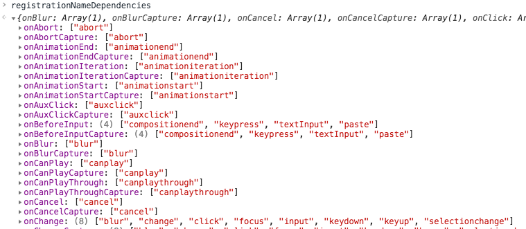

# React 事件系统源码分析

# 通用事件插件系统

来自源码

```
/**
 * Summary of `ReactBrowserEventEmitter` event handling:
 *
 *  - Top-level delegation is used to trap most native browser events. This
 *    may only occur in the main thread and is the responsibility of
 *    ReactDOMEventListener, which is injected and can therefore support
 *    pluggable event sources. This is the only work that occurs in the main
 *    thread.
 *
 *  - We normalize and de-duplicate events to account for browser quirks. This
 *    may be done in the worker thread.
 *
 *  - Forward these native events (with the associated top-level type used to
 *    trap it) to `EventPluginHub`, which in turn will ask plugins if they want
 *    to extract any synthetic events.
 *
 *  - The `EventPluginHub` will then process each event by annotating them with
 *    "dispatches", a sequence of listeners and IDs that care about that event.
 *
 *  - The `EventPluginHub` then dispatches the events.
 *
 * Overview of React and the event system:
 *
 * +------------+    .
 * |    DOM     |    .
 * +------------+    .
 *       |           .
 *       v           .
 * +------------+    .
 * | ReactEvent |    .
 * |  Listener  |    .
 * +------------+    .                         +-----------+
 *       |           .               +--------+|SimpleEvent|
 *       |           .               |         |Plugin     |
 * +-----|------+    .               v         +-----------+
 * |     |      |    .    +--------------+                    +------------+
 * |     +-----------.--->|EventPluginHub|                    |    Event   |
 * |            |    .    |              |     +-----------+  | Propagators|
 * | ReactEvent |    .    |              |     |TapEvent   |  |------------|
 * |  Emitter   |    .    |              |<---+|Plugin     |  |other plugin|
 * |            |    .    |              |     +-----------+  |  utilities |
 * |     +-----------.--->|              |                    +------------+
 * |     |      |    .    +--------------+
 * +-----|------+    .                ^        +-----------+
 *       |           .                |        |Enter/Leave|
 *       +           .                +-------+|Plugin     |
 * +-------------+   .                         +-----------+
 * | application |   .
 * |-------------|   .
 * |             |   .
 * |             |   .
 * +-------------+   .
 *                   .
 *    React Core     .  General Purpose Event Plugin System
 */
```

# 注册事件

<!-- 我们当做props传递给组件的onClick onChange是如何绑定到DOM上的尼？？ -->

-   finalizeInitialChildren
-   setInitialProperties
-   setInitialDOMProperties
-   listenTo

在 ReactFiberCompleteWork 的时候

在 updateHostComponent 调用  
completeWork 的时候当 tag 为 HostComponent 调用

top+eventType

### listenTo

兼容了各个浏览器，先从 click 事件说起

```javascript
export function listenTo(registrationName, mountAt) {
	const isListening = getListeningForDocument(mountAt);
	const dependencies = registrationNameDependencies[registrationName];

	for (let i = 0; i < dependencies.length; i++) {
		const dependency = dependencies[i];
		if (
			!(isListening.hasOwnProperty(dependency) && isListening[dependency])
		) {
			switch (dependency) {
				default:
					// By default, listen on the top level to all non-media events.
					// Media events don't bubble so adding the listener wouldn't do anything.
					const isMediaEvent =
						mediaEventTypes.indexOf(dependency) !== -1;
					if (!isMediaEvent) {
						trapBubbledEvent(dependency, mountAt);
					}
					break;
			}
			isListening[dependency] = true;
		}
	}
}
```

```javascript
const topListenersIDKey = '_reactListenersID' + ('' + Math.random()).slice(2);
let reactTopListenersCounter = 0;

function getListeningForDocument(mountAt: any) {
	// In IE8, `mountAt` is a host object and doesn't have `hasOwnProperty`
	// directly.
	if (!Object.prototype.hasOwnProperty.call(mountAt, topListenersIDKey)) {
		mountAt[topListenersIDKey] = reactTopListenersCounter++;
		alreadyListeningTo[mountAt[topListenersIDKey]] = {};
	}
	return alreadyListeningTo[mountAt[topListenersIDKey]];
}
```

如果当前 Document 对象上没有`topListenersIDKey`属性，将`topListenersIDKey`加 1 并`alreadyListeningTo`上对应的值置为空对象。  
如果有`topListenersIDKey`这个属性则将`topListenersIDKey`上的值直接返回

registrationNameDependencies：



如上图，onClick 对应着 onClick 事件，onChange 对应着 "blur", "change", "click", "focus", "input", "keydown", "keyup", "selectionchange"事件。

再来看这个循环，如果满足`isListening`不存在 属性 `dependency`或者 存在这个属性为一个 false 值

```javascript
!(isListening.hasOwnProperty(dependency) && isListening[dependency])

// 相当于
!isListening.hasOwnProperty(dependency) || !isListening[dependency])
```

React 忽略媒体事件？

## trapBubbledEvent

```javascript
function trapBubbledEvent(topLevelType, element) {
	if (!element) {
		return null;
	}
	const dispatch = isInteractiveTopLevelEventType(topLevelType)
		? dispatchInteractiveEvent
		: dispatchEvent;

	addEventBubbleListener(
		element,
		getRawEventName(topLevelType),
		// Check if interactive and wrap in interactiveUpdates
		dispatch.bind(null, topLevelType),
	);
}
```

先看一下`simpleEventPlugin`这个插件

topLevelEventsToDispatchConfig:


```javascript
SimpleEventPlugin = {
	isInteractiveTopLevelEventType(topLevelType) {
		const config = topLevelEventsToDispatchConfig[topLevelType];
		return config !== undefined && config.isInteractive === true;
	},
	extractEvents() {},
};
```

显然对于`click`事件 `isInteractiveTopLevelEventType`返回值是一个 true

```javascript
let _interactiveUpdatesImpl = function(fn, a, b) {
	return fn(a, b);
};

export function interactiveUpdates(fn, a, b) {
	return _interactiveUpdatesImpl(fn, a, b);
}

function dispatchInteractiveEvent(topLevelType, nativeEvent) {
	interactiveUpdates(dispatchEvent, topLevelType, nativeEvent);
}
```

`dispatchInteractiveEvent`实际上就是调用 `dispatchEvent`函数，并将`topLevelType`, `nativeEvent`当做参数传入到`dispatchEvent`。 而`dispatchEvent`就到了发布事件的阶段

## `addEventCaptureListener`

```javascript
function addEventCaptureListener(element, eventType, listener): void {
	element.addEventListener(eventType, listener, true);
}
```

这段代码就是使用`addEventListener`将事件注册到`document`上。

# 发布事件

```javascript
function dispatchEvent(topLevelType, nativeEvent) {
	if (!_enabled) {
		return;
	}

	const nativeEventTarget = getEventTarget(nativeEvent);

	// 获取最近fiber
	let targetInst = getClosestInstanceFromNode(nativeEventTarget);
	if (
		targetInst !== null &&
		typeof targetInst.tag === 'number' &&
		!isFiberMounted(targetInst)
	) {
		// If we get an event (ex: img onload) before committing that
		// component's mount, ignore it for now (that is, treat it as if it was an
		// event on a non-React tree). We might also consider queueing events and
		// dispatching them after the mount.
		targetInst = null;
	}

	const bookKeeping = getTopLevelCallbackBookKeeping(
		topLevelType,
		nativeEvent,
		targetInst,
	);

	try {
		// Event queue being processed in the same cycle allows
		// `preventDefault`.
		batchedUpdates(handleTopLevel, bookKeeping);
	} finally {
		releaseTopLevelCallbackBookKeeping(bookKeeping);
	}
}
```

```javascript
function getEventTarget(nativeEvent) {
	// Fallback to nativeEvent.srcElement for IE9
	// https://github.com/facebook/react/issues/12506
	let target = nativeEvent.target || nativeEvent.srcElement || window;

	// Normalize SVG <use> element events #4963
	if (target.correspondingUseElement) {
		target = target.correspondingUseElement;
	}

	// Safari may fire events on text nodes (Node.TEXT_NODE is 3).
	// @see http://www.quirksmode.org/js/events_properties.html
	return target.nodeType === TEXT_NODE ? target.parentNode : target;
}
```

获取到事件源 并做了跨平台的兼容。 如果当前是一个文字节点 则事件源为他的父元素。

```javascript
const randomKey = Math.random()
	.toString(36)
	.slice(2);
const internalInstanceKey = '__reactInternalInstance$' + randomKey;

export function getClosestInstanceFromNode(node) {
	if (node[internalInstanceKey]) {
		return node[internalInstanceKey];
	}

	while (!node[internalInstanceKey]) {
		if (node.parentNode) {
			node = node.parentNode;
		} else {
			// Top of the tree. This node must not be part of a React tree (or is
			// unmounted, potentially).
			return null;
		}
	}

	let inst = node[internalInstanceKey];
	if (inst.tag === HostComponent || inst.tag === HostText) {
		// In Fiber, this will always be the deepest root.
		return inst;
	}

	return null;
}
```

如果当前元素上有`internalInstanceKey`属性（fiber 节点），则返回；如果没有则向他的父元素查找，如果都没有则返回 null；

如果当前元素的某一个上级元素包含`internalInstanceKey`属性。如果当前 fiber 是一个`Host` 或者是`HostText`类型，则返回这个 fiber；否则返回 null

继续向下走：

```javascript
function isFiberMountedImpl(fiber: Fiber): number {
	let node = fiber;
	if (!fiber.alternate) {
		// If there is no alternate, this might be a new tree that isn't inserted
		// yet. If it is, then it will have a pending insertion effect on it.
		if ((node.effectTag & Placement) !== NoEffect) {
			return MOUNTING;
		}
		while (node.return) {
			node = node.return;
			if ((node.effectTag & Placement) !== NoEffect) {
				return MOUNTING;
			}
		}
	} else {
		while (node.return) {
			node = node.return;
		}
	}
	if (node.tag === HostRoot) {
		// TODO: Check if this was a nested HostRoot when used with
		// renderContainerIntoSubtree.
		return MOUNTED;
	}
	// If we didn't hit the root, that means that we're in an disconnected tree
	// that has been unmounted.
	return UNMOUNTED;
}

function isFiberMounted(fiber) {
	return isFiberMountedImpl(fiber) === MOUNTED;
}
```

主要目的是判断 fiber 是否渲染，逻辑如下：

如果当前 fiber 没有`alternate`备份 fiber 说明新的树还没有被插入；且当前 或者它向上的父节点存在满足`(node.effectTag & Placement) !== NoEffect`返回正在渲染；

否则，找到 fiber 的根节点 fiberRoot; 如果当前的 tag 为`HostRoot`则返回渲染完毕；如果我们没找到 fiberRoot 则说明这是一颗被销毁了的树；

那让我们回到`dispatchEvent`： 这个判断条件主要是作用：找到最近的 host fiber，如果当前正在渲染或已经被销毁；则将`targetInst`置为 null；注释的解释为 如果我们在 commit 组件的渲染之前就或接收到这个事件，在当时忽略它；我们也会考虑排队的事件，在渲染之后发布它们。

```javascript
function getTopLevelCallbackBookKeeping(topLevelType, nativeEvent, targetInst) {
	if (callbackBookkeepingPool.length) {
		const instance = callbackBookkeepingPool.pop();
		instance.topLevelType = topLevelType;
		instance.nativeEvent = nativeEvent;
		instance.targetInst = targetInst;
		return instance;
	}
	return {
		topLevelType,
		nativeEvent,
		targetInst,
		ancestors: [],
	};
}
```

如果当前的`callbackBookkeepingPool`存在回调；则出栈，将参数赋给这个 inst；否则将参数组合成一个对象；

那`callbackBookkeepingPool`内的数据是哪里来的尼？

```javascript
function releaseTopLevelCallbackBookKeeping(instance) {
	instance.topLevelType = null;
	instance.nativeEvent = null;
	instance.targetInst = null;
	instance.ancestors.length = 0;
	if (callbackBookkeepingPool.length < CALLBACK_BOOKKEEPING_POOL_SIZE) {
		callbackBookkeepingPool.push(instance);
	}
}
```

```javascript
function findRootContainerNode(inst) {
	// TODO: It may be a good idea to cache this to prevent unnecessary DOM
	// traversal, but caching is difficult to do correctly without using a
	// mutation observer to listen for all DOM changes.
	while (inst.return) {
		inst = inst.return;
	}
	if (inst.tag !== HostRoot) {
		// This can happen if we're in a detached tree.
		return null;
	}
	return inst.stateNode.containerInfo;
}

function handleTopLevel(bookKeeping) {
	let targetInst = bookKeeping.targetInst;

	let ancestor = targetInst;

	do {
		if (!ancestor) {
			bookKeeping.ancestors.push(ancestor);
			break;
		}
		const root = findRootContainerNode(ancestor);
		if (!root) {
			break;
		}
		bookKeeping.ancestors.push(ancestor);
		ancestor = getClosestInstanceFromNode(root);
	} while (ancestor);

	for (let i = 0; i < bookKeeping.ancestors.length; i++) {
		targetInst = bookKeeping.ancestors[i];
		runExtractedEventsInBatch(
			bookKeeping.topLevelType,
			targetInst,
			bookKeeping.nativeEvent,
			getEventTarget(bookKeeping.nativeEvent),
		);
	}
}
```

遍历层次结构，以防有任何嵌套的组件（可能指再次使用了 ReactDOM.render 到现在的 React 节点上）。在调用所有的事件回调之前构建祖先的数组是很重要的，因为事件回调可能会修改 DOM，导致与 ReactMount 的节点缓存不一致。

```javascript
// EventPluginRegistry.js
export const plugins = [];

function extractEvents(
	topLevelType,
	targetInst,
	nativeEvent,
	nativeEventTarget,
) {
	let events = null;
	for (let i = 0; i < plugins.length; i++) {
		// Not every plugin in the ordering may be loaded at runtime.
		// some thing...
	}
	return events;
}

export function runExtractedEventsInBatch(
	topLevelType,
	targetInst,
	nativeEvent,
	nativeEventTarget,
) {
	const events = extractEvents(
		topLevelType,
		targetInst,
		nativeEvent,
		nativeEventTarget,
	);
	runEventsInBatch(events);
}
```

先看`extractEvents`先关的变量`plugins`,初始时为一个空数组，在哪里注入的尼？

在`ReactDOM`文件引入了`ReactDOMClientInjection.js`文件 引入`EventPluginHub.js`的 `injection`作为`EventPluginHubInjection`,执行`EventPluginHubInjection.injectEventPluginOrder`, `EventPluginHubInjection.injectEventPluginsByName`, plugin 注入的顺序如下：

```javascript
// ReactDOMClientInjection.js
const DOMEventPluginOrder = [
	'ResponderEventPlugin',
	'SimpleEventPlugin',
	'EnterLeaveEventPlugin',
	'ChangeEventPlugin',
	'SelectEventPlugin',
	'BeforeInputEventPlugin',
];

// 在浏览器环境所插入的插件为

EventPluginHubInjection.injectEventPluginsByName({
	SimpleEventPlugin: SimpleEventPlugin,
	EnterLeaveEventPlugin: EnterLeaveEventPlugin,
	ChangeEventPlugin: ChangeEventPlugin,
	SelectEventPlugin: SelectEventPlugin,
	BeforeInputEventPlugin: BeforeInputEventPlugin,
});
```

具体逻辑在`EventPluginRegistry`中 我们先看代码

```javascript
let eventPluginOrder: EventPluginOrder = null;
const namesToPlugins: NamesToPlugins = {};

function recomputePluginOrdering() {
	if (!eventPluginOrder) {
		// Wait until an `eventPluginOrder` is injected.
		return;
	}
	for (const pluginName in namesToPlugins) {
		const pluginModule = namesToPlugins[pluginName];
		const pluginIndex = eventPluginOrder.indexOf(pluginName);
		if (plugins[pluginIndex]) {
			continue;
		}
		plugins[pluginIndex] = pluginModule;
		const publishedEvents = pluginModule.eventTypes;
		for (const eventName in publishedEvents) {
			invariant(
				publishEventForPlugin(
					publishedEvents[eventName],
					pluginModule,
					eventName,
				),
				'EventPluginRegistry: Failed to publish event `%s` for plugin `%s`.',
				eventName,
				pluginName,
			);
		}
	}
}

export function injectEventPluginOrder(injectedEventPluginOrder) {
	// Clone the ordering so it cannot be dynamically mutated.
	eventPluginOrder = Array.prototype.slice.call(injectedEventPluginOrder);
	recomputePluginOrdering();
}
```

在 ReactDOM 加载的时候，`EventPluginHubInjection.injectEventPluginOrder`的调用在`EventPluginRegistry`中写入`eventPluginOrder`，;执行`recomputePluginOrdering`；此时`namesToPlugins`内并没有任何插件的名称。

```javascript
// EventPluginRegistry.js
export function injectEventPluginsByName(injectedNamesToPlugins) {
	let isOrderingDirty = false;
	for (const pluginName in injectedNamesToPlugins) {
		if (!injectedNamesToPlugins.hasOwnProperty(pluginName)) {
			continue;
		}
		const pluginModule = injectedNamesToPlugins[pluginName];
		if (
			!namesToPlugins.hasOwnProperty(pluginName) ||
			namesToPlugins[pluginName] !== pluginModule
		) {
			namesToPlugins[pluginName] = pluginModule;
			isOrderingDirty = true;
		}
	}
	if (isOrderingDirty) {
		recomputePluginOrdering();
	}
}
```

继续执行`EventPluginHubInjection.injectEventPluginsByName`, 在注入插件的时候，第一步就是标记此时`isOrderingDirty`为`false`，遍历参数`injectedNamesToPlugins`与`namesToPlugins`对比 如果`injectedNamesToPlugins`中的一项在`namesToPlugins`中不存在或者不相等，则更新`namesToPlugins`的值，并标记`isOrderingDirty`为 true，并在遍历结束 调用`recomputePluginOrdering`重新排序。让我们接着看看重新排序的逻辑基本上就是按照`如果eventPluginOrder`的顺序来。在排序的同时，顺便将值赋值给`plugins`。

那我们在回过头来看`extractEvents`内的遍历 plugins 逻辑

```javascript
const possiblePlugin = plugins[i];
if (possiblePlugin) {
	const extractedEvents = possiblePlugin.extractEvents(
		topLevelType,
		targetInst,
		nativeEvent,
		nativeEventTarget,
	);
	if (extractedEvents) {
		events = accumulateInto(events, extractedEvents);
	}
}
```

每个事件插件都有一个`extractEvents`，我们先来看`SimpleEventPlugin`，就看

```javascript
// SimpleEventPlugin
const SimpleEventPlugin = {
    extractEvents: function(
        topLevelType,
        targetInst,
        nativeEvent,
        nativeEventTarget
    ) {
        const dispatchConfig = topLevelEventsToDispatchConfig[topLevelType];
        if (!dispatchConfig) {
        return null;
        }
        let Event
    }
}

```

// TODO 作用 目的
来自于`batchedUpdates`之后的`releaseTopLevelCallbackBookKeeping`；

来看`batchedUpdates`

```javascript
let isBatching = false;
export function batchedUpdates(fn, bookkeeping) {
	if (isBatching) {
		// If we are currently inside another batch, we need to wait until it
		// fully completes before restoring state.
		return fn(bookkeeping);
	}
	isBatching = true;
	try {
		return _batchedUpdatesImpl(fn, bookkeeping);
	} finally {
		// Here we wait until all updates have propagated, which is important
		// when using controlled components within layers:
		// https://github.com/facebook/react/issues/1698
		// Then we restore state of any controlled component.
		isBatching = false;
		const controlledComponentsHavePendingUpdates = needsStateRestore();
		if (controlledComponentsHavePendingUpdates) {
			// If a controlled event was fired, we may need to restore the state of
			// the DOM node back to the controlled value. This is necessary when React
			// bails out of the update without touching the DOM.
			_flushInteractiveUpdatesImpl();
			restoreStateIfNeeded();
		}
	}
}
```

如果当前`isBatching`为`true`，则直接调用你在元素上绑定的函数；为`false`，将先将`isBatching`置为 true，调用`_batchedUpdatesImpl`, 然后调用`needsStateRestore`, 这个`_batchedUpdatesImpl`来自哪里？在`ReactGenericBatching.js`文件提供了一个`setBatchingImplementation`方法，在`ReactDOM`文件中被设置，可以理解为在应用的一开始就被设置，而这些方法 `interactiveUpdates`, `batchedUpdatesImpl`, `flushInteractiveUpdates` 都来自`ReactFiberScheduler`文件，即来自于调度器；

// TODO 作用

```javascript
let restoreTarget = null;
let restoreQueue = null;

export function needsStateRestore(): boolean {
	return restoreTarget !== null || restoreQueue !== null;
}
```

```javascript
export function restoreStateIfNeeded() {
	if (!restoreTarget) {
		return;
	}
	const target = restoreTarget;
	const queuedTargets = restoreQueue;
	restoreTarget = null;
	restoreQueue = null;

	restoreStateOfTarget(target);
	if (queuedTargets) {
		for (let i = 0; i < queuedTargets.length; i++) {
			restoreStateOfTarget(queuedTargets[i]);
		}
	}
}

if (controlledComponentsHavePendingUpdates) {
	// If a controlled event was fired, we may need to restore the state of
	// the DOM node back to the controlled value. This is necessary when React
	// bails out of the update without touching the DOM.
	_flushInteractiveUpdatesImpl();
	restoreStateIfNeeded();
}
```

```javascript
function flushInteractiveUpdates() {
	if (
		!isRendering &&
		lowestPriorityPendingInteractiveExpirationTime !== NoWork
	) {
		// Synchronously flush pending interactive updates.
		performWork(lowestPriorityPendingInteractiveExpirationTime, false);
		lowestPriorityPendingInteractiveExpirationTime = NoWork;
	}
}
```

## Issue 如何理解插件机制
