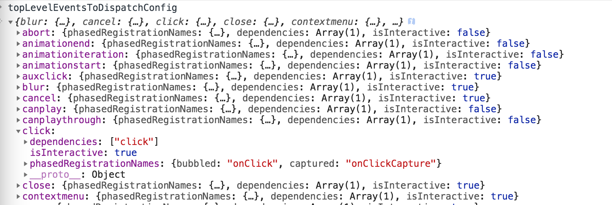

# React 事件系统源码分析

版本 v16.7

# 通用事件插件系统

来自源码

```
/**
 * Summary of `ReactBrowserEventEmitter` event handling:
 *
 *  - Top-level delegation is used to trap most native browser events. This
 *    may only occur in the main thread and is the responsibility of
 *    ReactDOMEventListener, which is injected and can therefore support
 *    pluggable event sources. This is the only work that occurs in the main
 *    thread.
 *
 *  - We normalize and de-duplicate events to account for browser quirks. This
 *    may be done in the worker thread.
 *
 *  - Forward these native events (with the associated top-level type used to
 *    trap it) to `EventPluginHub`, which in turn will ask plugins if they want
 *    to extract any synthetic events.
 *
 *  - The `EventPluginHub` will then process each event by annotating them with
 *    "dispatches", a sequence of listeners and IDs that care about that event.
 *
 *  - The `EventPluginHub` then dispatches the events.
 *
 * Overview of React and the event system:
 *
 * +------------+    .
 * |    DOM     |    .
 * +------------+    .
 *       |           .
 *       v           .
 * +------------+    .
 * | ReactEvent |    .
 * |  Listener  |    .
 * +------------+    .                         +-----------+
 *       |           .               +--------+|SimpleEvent|
 *       |           .               |         |Plugin     |
 * +-----|------+    .               v         +-----------+
 * |     |      |    .    +--------------+                    +------------+
 * |     +-----------.--->|EventPluginHub|                    |    Event   |
 * |            |    .    |              |     +-----------+  | Propagators|
 * | ReactEvent |    .    |              |     |TapEvent   |  |------------|
 * |  Emitter   |    .    |              |<---+|Plugin     |  |other plugin|
 * |            |    .    |              |     +-----------+  |  utilities |
 * |     +-----------.--->|              |                    +------------+
 * |     |      |    .    +--------------+
 * +-----|------+    .                ^        +-----------+
 *       |           .                |        |Enter/Leave|
 *       +           .                +-------+|Plugin     |
 * +-------------+   .                         +-----------+
 * | application |   .
 * |-------------|   .
 * |             |   .
 * |             |   .
 * +-------------+   .
 *                   .
 *    React Core     .  General Purpose Event Plugin System
 */
```

# 注册事件

在初始化组件和更新组件的时候会根据属性的类型设置类型，而对事件有着特殊的处理：
具体的代码在`ReactDOMComponent.js`中的[`setInitialDOMProperties`](https://github.com/facebook/react/blob/v16.7.0/packages/react-dom/src/client/ReactDOMComponent.js#L339)方法内

```javascript
if (registrationNameModules.hasOwnProperty(propKey)) {
	if (nextProp != null) {
		ensureListeningTo(rootContainerElement, propKey);
	}
}
```

registrationNameModules：


先从具体的例子来分析

```javascript
class Test extends React.Component {
    handleClick = () => {
        console.error('click....')
    }

    render() {
        return (
            <div onClick={this.handleClick}>click me</div>
        )
    }
}
```
显然`registrationNameModules.hasOwnProperty('onClick')`是成立的，然后将我们的根元素`rootContainerElement`和当前的`propsKey`当做参数调用[`ensureListeningTo`](https://github.com/facebook/react/blob/v16.7.0/packages/react-dom/src/client/ReactDOMComponent.js#L256)，这个方法其实就是找到`document`，将它和`propsKey`当做参数传入[`listenTo`](https://github.com/facebook/react/blob/v16.7.0/packages/react-dom/src/events/ReactBrowserEventEmitter.js#L126)方法调用。

```javascript
export function listenTo(registrationName, mountAt) {
	const isListening = getListeningForDocument(mountAt);
	const dependencies = registrationNameDependencies[registrationName];

	for (let i = 0; i < dependencies.length; i++) {
		const dependency = dependencies[i];
		if (
			!(isListening.hasOwnProperty(dependency) && isListening[dependency])
		) {
			switch (dependency) {
				default:
					// By default, listen on the top level to all non-media events.
					// Media events don't bubble so adding the listener wouldn't do anything.
					const isMediaEvent =
						mediaEventTypes.indexOf(dependency) !== -1;
					if (!isMediaEvent) {
						trapBubbledEvent(dependency, mountAt);
					}
					break;
			}
			isListening[dependency] = true;
		}
	}
}
```
registrationNameDependencies：


如上图，`onClick`对应着单个click（像`onChange`对应的就多了）。所以此时的`dependencies`为`['click']`，而注册同一种事件类型只会被注册到document一次；而`isListening`的作用就是为此。

[`trapBubbledEvent`](https://github.com/facebook/react/blob/v16.7.0/packages/react-dom/src/events/ReactDOMEventListener.js#L137)

```javascript
function addEventCaptureListener(
  element: Document | Element,
  eventType: string,
  listener: Function,
): void {
  element.addEventListener(eventType, listener, true);
}

function trapBubbledEvent(topLevelType, element) {
	if (!element) {
		return null;
	}
	const dispatch = isInteractiveTopLevelEventType(topLevelType)
		? dispatchInteractiveEvent
		: dispatchEvent;

	addEventBubbleListener(
		element,
		getRawEventName(topLevelType),
		// Check if interactive and wrap in interactiveUpdates
		dispatch.bind(null, topLevelType),
	);
}
```
这一步主要是在`document`设置监听回调，下面是细节：

先看一下`simpleEventPlugin`这个插件

```javascript
SimpleEventPlugin = {
	isInteractiveTopLevelEventType(topLevelType) {
		const config = topLevelEventsToDispatchConfig[topLevelType];
		return config !== undefined && config.isInteractive === true;
	},
	extractEvents() {},
};
```

topLevelEventsToDispatchConfig:

显然对于`click`事件 `isInteractiveTopLevelEventType`返回值是一个`true`

```javascript
let _interactiveUpdatesImpl = function(fn, a, b) {
	return fn(a, b);
};

export function interactiveUpdates(fn, a, b) {
	return _interactiveUpdatesImpl(fn, a, b);
}

function dispatchInteractiveEvent(topLevelType, nativeEvent) {
	interactiveUpdates(dispatchEvent, topLevelType, nativeEvent);
}
```

`dispatchInteractiveEvent`实际上就是调用 `dispatchEvent`函数。

// TODO 两者的区别

# 发布事件

```javascript
function dispatchEvent(topLevelType, nativeEvent) {
	if (!_enabled) {
		return;
	}
	const nativeEventTarget = getEventTarget(nativeEvent);
	let targetInst = getClosestInstanceFromNode(nativeEventTarget);
	if (
		targetInst !== null &&
		typeof targetInst.tag === 'number' &&
		!isFiberMounted(targetInst)
	) {
		targetInst = null;
	}

	const bookKeeping = getTopLevelCallbackBookKeeping(
		topLevelType,
		nativeEvent,
		targetInst,
	);

	try {
		batchedUpdates(handleTopLevel, bookKeeping);
	} finally {
		releaseTopLevelCallbackBookKeeping(bookKeeping);
	}
}
```
首先获取当前的原生事件对应的DOM，再找到对应的临近的一个fiber。  
然后就是一个判断一个当前是否正在渲染的逻辑（具体逻辑先不细究）

[`getTopLevelCallbackBookKeeping`](https://github.com/facebook/react/blob/v16.7.0/packages/react-dom/src/events/ReactDOMEventListener.js#L50)方法与`callbackBookkeepingPool`对象和[`releaseTopLevelCallbackBookKeeping`](https://github.com/facebook/react/blob/v16.7.0/packages/react-dom/src/events/ReactDOMEventListener.js#L75)构建了一套`bookkeeping`对象的复用系统。

具体为：`getTopLevelCallbackBookKeeping`先从`callbackBookkeepingPool`对象池中获取一个对象，如果不存在则创建一个初始对象，在这个对象使用完毕之后，将所有的值置为null 或空数组，回收到`callbackBookkeepingPool`这个对象池中。这也是React做的一个优化。

一个bookkeep对象的结构为：
```javascript
const bookKeeping = {
    topLevelType: null,
    nativeEvent: null,
    targetInst: null,
    ancestors: [],
}
```

[`batchedUpdates`](https://github.com/facebook/react/blob/v16.7.0/packages/events/ReactGenericBatching.js#L29)现在先简单看作是一个方法的调用，所以后面的逻辑就在[`handleTopLevel`](https://github.com/facebook/react/blob/v16.7.0/packages/react-dom/src/events/ReactDOMEventListener.js#L85)的调用上
```javascript
function findRootContainerNode(inst) {
	// TODO: It may be a good idea to cache this to prevent unnecessary DOM
	// traversal, but caching is difficult to do correctly without using a
	// mutation observer to listen for all DOM changes.
	while (inst.return) {
		inst = inst.return;
	}
	if (inst.tag !== HostRoot) {
		// This can happen if we're in a detached tree.
		return null;
	}
	return inst.stateNode.containerInfo;
}

function handleTopLevel(bookKeeping) {
	let targetInst = bookKeeping.targetInst;

	let ancestor = targetInst;

	do {
		if (!ancestor) {
			bookKeeping.ancestors.push(ancestor);
			break;
		}
		const root = findRootContainerNode(ancestor);
		if (!root) {
			break;
		}
		bookKeeping.ancestors.push(ancestor);
		ancestor = getClosestInstanceFromNode(root);
	} while (ancestor);

	for (let i = 0; i < bookKeeping.ancestors.length; i++) {
		targetInst = bookKeeping.ancestors[i];
		runExtractedEventsInBatch(
			bookKeeping.topLevelType,
			targetInst,
			bookKeeping.nativeEvent,
			getEventTarget(bookKeeping.nativeEvent),
		);
	}
}
```
正常使用我们只有一个根节点，即`bookKeeping.ancestors`的长度为1，那什么情况下长度大于1尼？
```javascript
class Test extends React.Component {
    componentDidMount() {
        ReactDOM.render(<div onClick={() => {
            console.error('l am clicked...')
        }}>
            second
        </div>, document.getElementById('#subApp'))
    }

    render() {
        return (
            <div>
                <div className="subApp"></div>
                <button></button>
            </div>
        )
    }
}
```
此时`bookKeeping.ancestors`长度为2，一个为当前对应的fiber， 一个是id为subApp的对应的fiber。

接着是调用[`runExtractedEventsInBatch`](https://github.com/facebook/react/blob/master/packages/events/EventPluginHub.js#L212)
这个方法可以分为两个部分：

- 提取事件对象
- 执行事件对象上的回调

```javascript
// EventPluginRegistry.js
export function runExtractedEventsInBatch(
	topLevelType,
	targetInst,
	nativeEvent,
	nativeEventTarget,
) {
	const events = extractEvents(
		topLevelType,
		targetInst,
		nativeEvent,
		nativeEventTarget,
	);
	runEventsInBatch(events);
}
```

### 提取事件对象
有关提取事件对象这就涉及到了事件插件机制了，

```javascript
function extractEvents(
	topLevelType,
	targetInst,
	nativeEvent,
	nativeEventTarget,
) {
	let events = null;
	for (let i = 0; i < plugins.length; i++) {
		// ....
	}
	return events;
}

```
目前浏览器端使用到了五种插件

- SimpleEventPlugin：简单事件插件，提取基本的合成事件
- EnterLeaveEventPlugin：鼠标移入移出事件，
- ChangeEventPlugin： change事件插件
- SelectEventPlugin： 选择事件
- BeforeInputEventPlugin：

simpleEventPlugin事件返回一个基本的合成事件对象，其他的四种事件主要是做事件的兼容处理， 使得合成事件行为尽量与原生；保证各个浏览器交互一致。  

遍历所有的插件，调用`extractEvents`方法，将各自返回的合成事件对象合并，最后返回值可能为`null` 合成事件对象或合成事件对象数组。

每个插件生成合成事件公用逻辑为：

拿冒泡事件举例：先从当前事件类型的事件池中拿到一个事件对象，向上遍历虚拟dom tree找具有相同的事件类型的祖先节点，获取该节点上的回调。
之后将这个实例、回调分别收集到`event`合成对象的`_dispatchListeners`,`_dispatchListeners`属性上。

```javascript
// SimpleEventPlugin
const SimpleEventPlugin = {
	extractEvents: function(
		topLevelType,
		targetInst,
		nativeEvent,
		nativeEventTarget,
	) {
		const dispatchConfig = topLevelEventsToDispatchConfig[topLevelType];
		if (!dispatchConfig) {
			return null;
		}
		let EventConstructor;

		//....
		EventConstructor = SyntheticEvent;
		const event = EventConstructor.getPooled(
			dispatchConfig,
			targetInst,
			nativeEvent,
			nativeEventTarget,
		);
		return event;
	},
};
```

