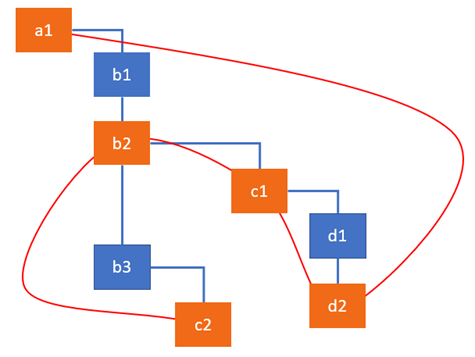
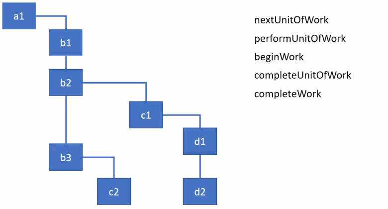

【译文】 深入概述新的React调和算法
====

原文链接：[Inside Fiber: in-depth overview of the new reconciliation algorithm in React](https://medium.com/react-in-depth/inside-fiber-in-depth-overview-of-the-new-reconciliation-algorithm-in-react-e1c04700ef6e)

本文概要

- 讨论调度程序的细节
- child 调和进程
- 创建一个effect list的机制


一个组件调用setState会发生什么

- 更新自身的state
- 检索并比较组件的子组件和他们的props
- 更新对应的组件

在调和阶段还有其他的活动行为，比如：调用生命周期或更新ref。这些行为在fiber架构中被统称为`work`。`work`的类型取决于React element的类型。例如：对于一个class组件React需要创建一个实例，对于function组件不需要的。正如我们所知的，在React中有很多组件类型，class组件，function组件，host组件（DOM 节点），portals，等。React的类型由`createElement`的第一个参数决定，这个方法经常在render内使用去创建一个元素。

# fiber nodes

在调和期间，从render方法返回的每个React元素的数据被合并到`fiber`树中，每个React元素都有一个相应的fiber节点。不像React元素，fiber不会每次render都重新创建。他们是包含组件状态的DOM元素的可变数据结构。

我们之前讨论过根据不同的React类型，框架会执行不同的活动。class组件调用生命周期和render方法，host组件则执行渲染DOM。所以React Element转换成相应类型的fiber节点，用于描述需要完成的`work`

你可以把fiber看成需要被完成的`work`，换句话说就是一个工作单元。fiber架构还提供了一种跟踪、安排、暂停、中断的便捷方式。

当React Element第一次被转换成fiber节点，React使用的数据在[createFiberFromTypeAndProps](https://github.com/facebook/react/blob/769b1f270e1251d9dbdce0fcbd9e92e502d059b8/packages/react-reconciler/src/ReactFiber.js#L414)方法创建fiber。在之后的更新中，React重用fiber节点，并使用来自相应React元素的数据去更新必要的属性。如果不再从render方法返回相应的React Element，React可能需要根据key props删除他

查看[ChildReconciler](https://github.com/facebook/react/blob/95a313ec0b957f71798a69d8e83408f40e76765b/packages/react-reconciler/src/ReactChildFiber.js#L239)方法以查看React为现有fiber节点执行的所有活动和相应方法的列表

// TODO 未翻译完

# Current and work in progress trees
在第一次渲染之后，React最终得到一个fiber树，它反映了用于渲染UI的应用程序的状态。这棵树通常被称为fiber树。当React开始处理更新时，它会构建一个所谓的workInProgress树，它反映了要刷新到屏幕的未来状态。

所有工作都在workInProgress fiber树上执行。当React遍历当前树时，对于每个现有fiber节点，它创建一个构成workInProgress树的备用节点。这个节点是使用render方法返回的React Element上的数据创建的。处理完更新并完成所有相关工作后，React将准备好一个备用树刷新到屏幕。一旦这个workInProgress树被渲染到屏幕上，他也就成了current树。

React的核心原则之一是一致性。React总是一次更新DOM - 它不会显示部分结果。workInProgress树被对待成用户不可见的"草稿"，以便React可以先处理所有组件，然后将其更改刷新到屏幕。

在源码中，可将看到许多从current和workInProgress上获取fiber节点的函数，例如：
```javascript
function updateHostComponent(current, workInProgress, renderExpirationTime) {...}
```

每个fiber节点保持其他树对应的引用（（alternate字段） 当前树中的节点指向workInProgress树中的节点，反之亦然。

# Side-effects
我们可以将React中的一个组件视为一个使用state和props来计算UI表示的函数。其他所有活动，如改变DOM或调用生命周期方法，都应该被视为副作用，或者简单地说是一种效果

您之前可能已经从React组件执行数据获取，订阅或手动更改DOM。我们将这些操作称为“副作用”（或简称为“效果”），因为它们会影响其他组件，且在渲染过程中无法完成。

您可以看到大多数状态和道具更新将导致副作用。用于调用effect是一种工作，fiber节点是一个方便的机制去追踪这次更新之外的effect。每个fiber节点都可以具有与之相关的effect。它们被编写在fiber的effectTag字段中。

因此，Fiber中的effect基本上定义了处理更新后需要为实例完成的工作。对于host组件（DOM元素），工作包括添加，更新或删除元素。对于class组件，React可能需要更新ref并调用componentDidMount和componentDidUpdate生命周期方法。还存在与其他类型的fiber相对应的其他effect。


# Effect List
React流程更新非常快，并且为了达到这种性能水平，它采用了一些有趣的技术。其中之一是构建fiber节点的线性列表，其具有快速迭代的效果。迭代线性列表比树快得多，并且没有必要在没有副作用的节点上花费时间。

此列表的目标是标记具有DOM更新或与其关联的其他Effect的节点，此列表是finishedWork树的子集，并使用nextEffect属性而不是current和workInProgress树中使用的子属性进行链接。

Dan 为为效果列表提供了一个类比。他喜欢把它当成一棵圣诞树。用“圣诞灯”将所有Effect节点绑定在一起。为了使这个可视化，让我们想象下面的fiber节点树，其中突出显示的节点有一些Effect要做。例如，我们的更新导致c2被插入到DOM中，d2和c1被用于更改属性，而b2被用于调用生命周期方法。effect列表会将它们链接在一起，以便React稍后可以跳过其他节点：



您可以看到具有Effect的节点如何链接在一起。当遍历节点时，React使用firstEffect指针来确定列表的开始位置。因此上图可以表示为这样的线性列表


如您所见，React按照从child到parent的顺序应用Effect。

# Root of the fiber tree
每个React应用程序都有一个或多个充当容器的DOM元素。React为每个容器创建一个fiber Root对象。您可以使用对DOM元素的引用来访问它

```javascript
const fiberRoot = document.getElementById('App')._reactRootContainer._internalRoot
```

这个fiber root是React保存对fiber树的引用的地方。它存储在fiber root的当前属性中：

```javascript
const hostRootFiberNode = fiberRoot.current
```
fiber树以特殊类型的fiber节点（HostRoot）开始。它是在内部创建的，并充当最顶层组件的父级。HostRoot fiber节点通过stateNode属性返回到FiberRoot。

```javascript
fiberRoot.current.stateNode === fiberRoot; // true
```

您可以通过fiber root访问最顶端的HostRoot fiber节点来遍历fiber树。或者，您可以从组件实例中获取单个fiber节点，如下所示：

```javascript
compInstance._reactInternalFiber

// this._reactInternalFiber
```

# Fiber node structure
假设有这么一段代码
```javascript
class App extends React.Component {
    state = { count: 0 }
    // ...
    render() {
        return (
            <span>{this.state.count}</span>
        )
    }
}
```

现在让我们来看看为其创建的fiber node的结构

App Component

```javascript
{
    stateNode: new App,
    type: App,
    alternate: null,
    key: null,
    updateQueue: null,
    memoizedState: {count: 0},
    pendingProps: {},
    memoizedProps: {},
    tag: 1,
    effectTag: 0,
    nextEffect: null
}
```

span Component

```javascript
{
    stateNode: new HTMLSpanElement,
    type: "span",
    alternate: null,
    key: "2",
    updateQueue: null,
    memoizedState: null,
    pendingProps: {children: 0},
    memoizedProps: {children: 0},
    tag: 5,
    effectTag: 0,
    nextEffect: null
}
```

fiber节点上有很多字段。我在前面的部分中描述了字段alternate，effectTag和nextEffect的用途。现在让我们看看为什么我们需要其他的。

## stateNode
保存对组件的类实例，DOM节点或与fiber节点关联的其他React元素类型的引用。通常，我们可以说该属性用于保持与fiber相关的本地状态。

## type
定义与此fiber关联的function或类。对于类组件，它指向构造函数，对于DOM元素，它指定HTML标记。使用这个字段来理解fiber节点与哪个元素相关

## tag
定义fiber的类型。它在协调算法中用于确定需要完成的work。如前所述，work取决于React元素的类型。函数createFiberFromTypeAndProps将React元素映射到相应的fiber节点类型。在我们的应用程序中，App组件的属性标记是1，表示ClassComponent，而span元素的属性标记是5，表示HostComponent。

## updateQueue
状态更新，回调和DOM更新的队列

## memoizedState
用于创建输出的fiber状态。处理更新时，它会反映当前在屏幕上呈现的状态。

## memoizedProps
fiber的props是用于创建上一次渲染的输出。

## pendingProps
已被React元素中的新数据更新并且需要应用于子组件或DOM元素的props

## key
具有一组子项的唯一标识符可帮助React确定哪些项已更改，已添加或从列表中删除

# General algorithm

React执行工作分为两个阶段：render和commit。

在第一个render阶段，React通过`setUpdate`和`React.render`方法将更新应用于计划中的组件，确定需要在UI中更新的内容。如果是初始渲染，React会为render方法返回的每个元素创建一个新的fiber节点。在后续的更新中，将重用和更新现有React元素的fiber。该阶段的结果是标记有副作用的fiber节点树。effect描述了在下一个commit阶段需要完成的工作。在此阶段，React采用标有effect的fiber树并将其应用于实例。它遍历effect列表并执行DOM更新和用户可见的其他更改。

重要的是要理解第一个render阶段的工作可以异步执行。React可以根据可用时间处理一个或多个fiber节点，因某些事件会 停止隐藏已完成的工作。之后它从它停止的地方继续。但有时候，它可能需要丢弃完成的工作并再次从顶部开始。由于在此阶段执行的工作不会导致任何用户可见的更改（例如DOM更新），因此可以实现这些暂停。相反，之后的commit阶段始终是同步的。这是因为在此阶段执行的工作导致用户可见的变化，例如， DOM更新。这就是为什么React需要在一次通过中完成它们

调用生命周期方法是React执行的一种work。在render阶段调用某些方法，在commit阶段调用其他方法。这是在完成第一个render阶段时调用的生命周期列表：

- [UNSAFE_]componentWillMount
- [UNSAFE_]componentWillReceiveProps
- getDerivedStateFromProps
- shouldComponentUpdate
- [UNSAFE_]componentWillUpdate
- render

如您所见，在render阶段执行的一些遗留生命周期方法在版本16.3中标记为UNSAFE。它们现在在文档中称为遗留生命周期。它们将在未来的16.x版本中弃用，而没有UNSAFE前缀的对应版本将在17.0中删除。

你是否对此感到好奇？

好吧，我们刚刚了解到，因为render阶段不会产生像DOM更新这样的副作用。React可以异步处理与组件异步的更新（甚至可能在多个线程中执行）。但是，标有UNSAFE的生命周期经常被误解和巧妙地误用。开发人员倾向于将带有副作用的代码放在这些方法中，这可能会导致新的异步呈现方法出现问题。虽然只有没有UNSAFE前缀的对应名称将被删除，但它们仍可能在即将出现的Concurrent Mode中引起问题。

以下是在第二个commit阶段执行的生命周期方法列表：

- getSnapshotBeforeUpdate
- componentDidMount
- componentDidUpdate
- componentWillUnmount

因为这些方法在同步提交阶段执行，所以它们可能包含副作用并接触DOM。好的，现在我们有了背景来看一下用于遍历树并执行工作的通用算法

# Render phase
协调算法始终使用renderRoot函数从最顶端的HostRootfiber节点开始。React从已经处理过的fiber节点中跳出，直到找到未完成工作的节点。例如，如果在组件树中深度调用setState，则React将从顶部开始，但会快速跳过父项，直到它到达调用了setState方法的组件为止。

## work loop的主要工作

所有的fiber节点在work loop中被处理。这是循环的同步部分的实现：

```javascript
function workLoop(isYieldy) {
  if (!isYieldy) {
    while (nextUnitOfWork !== null) {
      nextUnitOfWork = performUnitOfWork(nextUnitOfWork);
    }
  } else {...}
}
```
在上面的代码中，nextUnitOfWork从workInProgress树中保存对fiber节点的引用，该树有一些工作要做。当React遍历Fibers树时，它使用此变量来知道是否有任何其他fiber节点未完成的工作。处理当前fiber后，变量将包含对树中下一个fiber节点的引用或null（代表没有fiber要处理）。在这种情况下，React退出work loop并准备提交更改。

有4个主要函数用于遍历树并启动或完成工作：

- performUnitOfWork
- beginWork
- completeUnitOfWork
- completeWork

要演示如何使用它们，请查看以下遍历fiber树的动画。每个函数都需要一个fiber节点进行处理，当React从这棵树向下遍历时，您可以看到当前活动的fiber节点发生了变化。您可以清楚地看到算法如何从一个分支转到另一个分支。它首先完成child的工作，然后转移到parent身边。



让我们从前两个函数performUnitOfWork和beginWork开始：

```javascript
function performUnitOfWork(workInProgress) {
    let next = beginWork(workInProgress);
    if (next === null) {
        next = completeUnitOfWork(workInProgress);
    }
    return next;
}

function beginWork(workInProgress) {
    console.log('work performed for ' + workInProgress.name);
    return workInProgress.child;
}
```

函数performUnitOfWork从workInProgress树接收fiber节点，并通过调用beginWork函数启动工作。这个函数将启动需要为fiber执行的所有活动。出于演示的目的，我们只需记录fiber的名称即可表示已完成工作。函数beginWork始终返回指向要在循环中处理的下一个子节点的指针或null。

如果有下一个子节点，它将被分配给workLoop函数中的变量nextUnitOfWork。但是，如果没有子节点，React知道它到达了分支的末尾，因此它可以完成当前节点。一旦节点完成，它将需要为兄弟节点执行工作并在此之后回溯到父节点。这是在completeUnitOfWork函数中完成的：

```javascript
function completeUnitOfWork(workInProgress) {
    while (true) {
        let returnFiber = workInProgress.return;
        let siblingFiber = workInProgress.sibling;

        nextUnitOfWork = completeWork(workInProgress);

        if (siblingFiber !== null) {
            // If there is a sibling, return it
            // to perform work for this sibling
            return siblingFiber;
        } else if (returnFiber !== null) {
            // If there's no more work in this returnFiber,
            // continue the loop to complete the parent.
            workInProgress = returnFiber;
            continue;
        } else {
            // We've reached the root.
            return null;
        }
    }
}

function completeWork(workInProgress) {
    console.log('work completed for ' + workInProgress.name);
    return null;
}
```

你可以看到函数的要点是一个很大的循环。当workInProgress节点没有子节点时，React会进入此函数。完成当前fiber的工作后，它会检查是否有兄弟节点。如果找到，React退出该函数并返回指向兄弟的指针。它将被分配给nextUnitOfWork变量，React将从这个兄弟开始执行分支的工作。它尚未完成父节点的工作。只有在完成以子节点开始的所有分支后，才能完成父节点和回溯的工作。

从实现中可以看出，performUnitOfWork和completeUnitOfWork主要用于迭代目的，而主要活动则在beginWork和completeWork函数中进行。在本系列的以下文章中，我们将了解App组件和span节点会发生什么，因为React步入beginWork和completeWork函数。

# Commit阶段
这个阶段开始于completeRoot阶段。这是React更新DOM并调用生命周期方法的地方。

当React进入这个阶段时，它有2棵树和effect列表。第一个树表示当前在屏幕上呈现的状态，第二个在render阶段构建了一个备用树。它在源码中称为finishedWork或workInProgress，表示需要在屏幕上反映的状态。此备用树通过子节点和兄弟节点指针与current树类似地链接。

有一个effect列表 - 来自通过nextEffect指针链接的finishedWork树的节点子集。请记住，效果列表是运行render阶段的结果。render的重点是确定需要插入，更新或删除哪些节点，以及哪些组件需要调用其生命周期方法。这就是effect列表告诉我们的内容。它正是在commit阶段迭代的节点集。

在commit阶段运行的主要函数是commitRoot。  
它大致执行以下操作：

- 在被标记`Snapshot`的节点上调用getSnapshotBeforeUpdate
- 在被标记被`Deletion`的节点上滴啊用 componentWillUnmount
- 执行dom插入 更新 删除
- 将finishedWork树设置为当前树
- 被标记`Placement`执行componentDidMount
- 被标记`Update`执行componentDidUpdate

// TODO
调用方法getSnapshotBeforeUpdate后，React提交树中的所有副作用。他需要做两个操作。第一遍执行所有DOM插入，更新，删除和ref卸载。然后，React将finishedWork树分配给FiberRoot，将workInProgress树标记为当前树。这是在commit阶段的第一次传递之后完成的，这样前一个树在componentWillUnmount期间仍然是当前的，但在第二次传递之前，所以在componentDidMount / Update期间完成的工作是最新的。在第二遍中，React调用所有其他生命周期方法和引用回调。这些方法作为单独的传递执行，因此已经调用了整个树中的所有放置，更新和删除。

以下是运行上述步骤的函数的要点：

```javascript
function commitRoot(root, finishedWork) {
    commitBeforeMutationLifecycles()
    commitAllHostEffects();
    root.current = finishedWork;
    commitAllLifeCycles();
}
```

这些子函数中的每一个都实现了一个循环，该循环遍历effect列表并检查效果的类型。当它找到与函数目的相关的effect时，它会应用它。

## Pre-mutation lifecycle methods

例如，这是在effect树上迭代并检查节点是否具有Snapshot effect的代码

```javascript
function commitBeforeMutationLifecycles() {
    while (nextEffect !== null) {
        const effectTag = nextEffect.effectTag;
        if (effectTag & Snapshot) {
            const current = nextEffect.alternate;
            commitBeforeMutationLifeCycles(current, nextEffect);
        }
        nextEffect = nextEffect.nextEffect;
    }
}
```
对于类组件，此效果意味着调用getSnapshotBeforeUpdate生命周期方法

## DOM updates
commitAllHostEffects是React执行DOM更新的函数。该函数基本上定义了需要为节点完成并执行它的操作类型
```javascript
function commitAllHostEffects() {
    switch (primaryEffectTag) {
        case Placement: {
            commitPlacement(nextEffect);
            ...
        }
        case PlacementAndUpdate: {
            commitPlacement(nextEffect);
            commitWork(current, nextEffect);
            ...
        }
        case Update: {
            commitWork(current, nextEffect);
            ...
        }
        case Deletion: {
            commitDeletion(nextEffect);
            ...
        }
    }
}
```
有趣的是，React调用componentWillUnmount方法作为commitDeletion函数中删除过程的一部分

## Post-mutation lifecycle methods
commitAllLifecycles是React调用所有剩余生命周期方法componentDidUpdate和componentDidMount的函数
